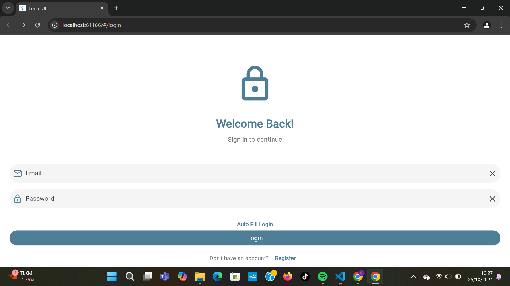
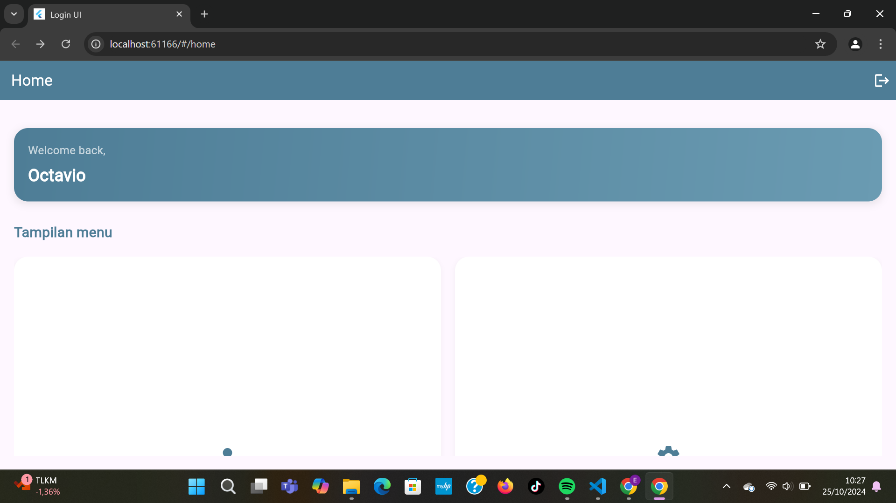
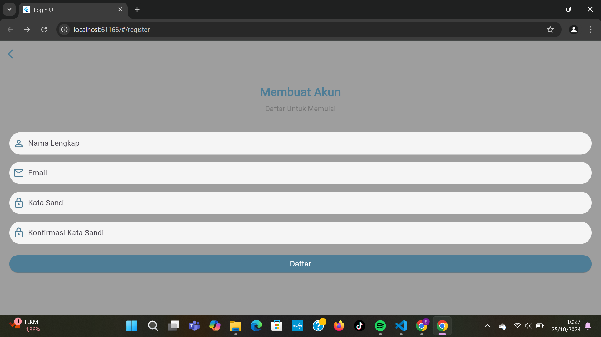

---

# Login Flutter App

### Ujian Tengah Semester (UTS)  
*Nama*  : Octavio Ellen Hariyadi
*Kelas* : 2D TRPL  
*NIM*   : 2101

---

## 📱 Aplikasi Login Flutter

Selamat datang di *Login Flutter App*, proyek aplikasi login sederhana yang dibuat menggunakan Flutter.

---

## 🚀 Memulai

Proyek ini adalah titik awal untuk aplikasi Flutter. Anda dapat menggunakan proyek ini untuk mempelajari dasar-dasar Flutter atau sebagai pondasi untuk membangun aplikasi lebih lanjut.

## 🛠 Fitur Aplikasi

- *UI Responsif*: Desain antarmuka yang menyesuaikan dengan berbagai ukuran layar.
- *Form Validasi*: Fitur validasi input pengguna pada form login.
- *Navigasi Halaman*: Navigasi yang mudah dan efisien antar halaman aplikasi.

---

## 🖼 Cuplikan Layar

| Tampilan 1 | Tampilan 2 | Tampilan 3 |
|------------|------------|------------|
|  |  |  |

---

## ⚙ Cara Menjalankan Proyek

1. *Clone Repository*:  
   bash
   git clone https://github.com/username/flutter-login-app.git
   

2. *Jalankan Aplikasi*:  
   Navigasi ke direktori proyek, kemudian jalankan perintah berikut:  
   bash
   flutter run
   

---

## Kontribusi

Jika Anda ingin berkontribusi pada proyek ini, silakan buat pull request atau buka issue untuk diskusi lebih lanjut.

---
**
